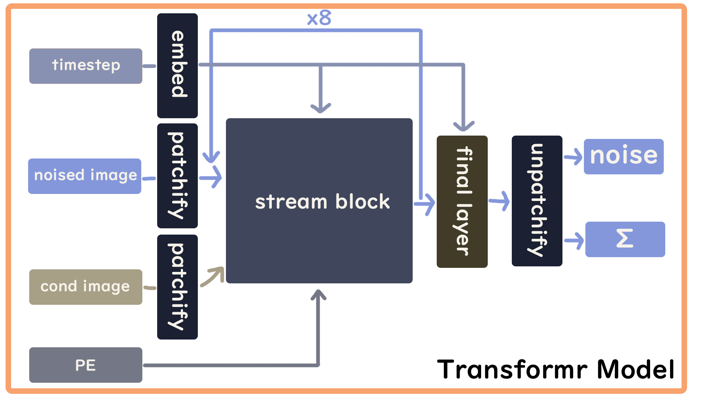

# Simple Novel View Synthesis use Diffusion Transformer

This project use simple Diffusion Transformer to synthesis novel view of original image view.

Here are some example (Horizontal rotate 60° Clockwise ⟳):
<div align="center">

| Original Image (with resize to fit model) | Generated Image |
|----------------|-----------------|
|  |  |
|  |  |
|  |  |
|  |  |

</div>

This project is my Graduate Project, and it's also my first time learning about and implementing a generative model. As a result, the architecture of the model is relatively simple, and there is plenty of room for improvement. However, I would be glad if this can help anyone who is learning about generative model.

This model is train on the server at my school. The hardware is RTX 2080Ti and 11GB VRAM. Due to the hardware and time limit, the input images are resized to small size. If there is better hardware or sufficient time, I think the larger image size will better the performance of model because resising image loss a lot of feature.

The model I originally intended to create was one with a single input and multiple outputs. Each output image represent a different view of original input image. With cross attention on each output view, I think it will improve performance at every different views. If it can generate multiview images, it can reconstruct a 3D model using those different view images.
## Acknowledgements

Diffsion is modified from OpenAI's diffusion repository:
 - [Guided Diffusion](https://github.com/openai/guided-diffusion/blob/main/guided_diffusion/gaussian_diffusion.py)
>
Font use in html:
-  [Gamja Flower](https://fonts.google.com/specimen/Gamja+Flower?preview.text=Meteors%20create%201234545&categoryFilters=Feeling:%2FExpressive%2FCute)
-  [Itim](https://fonts.google.com/specimen/Itim?preview.text=Meteors%20create%201234545&categoryFilters=Feeling:%2FExpressive%2FCute)


## Dataset

There are two dataset train seperatly on the model(not join train. there are two model weights.)

- [Objaverse dataset](https://objaverse.allenai.org/objaverse-1.0)

Objaverse dataset: It has 800K+ data. This model only train on about 50K data due to the hardware and time limit. Each image pair compose of a random selected view as original view and a horizontal 60&deg; rotated view from the original view as a target view. (The images is preprocess from the 3D model dataset)

- [MVC dataset](https://github.com/MVC-Datasets/MVC)

MVC dataset: It has about 35K data. This model train on almost all data. Each image pair compose of the right side cloths image and the left side cloths image to minic the training on Objaverse dataset(60&deg; horizontal rotation).

Preprocessed Data train on this model at [here](https://drive.google.com/drive/folders/1RfAKRQFC3Ag8T2npIAM1qmr6Ygwnws55?usp=drive_link).
## Training & Sampling
On training, two images with different view compose a pair. One is the original image, the other is the target image. The model accept pairs that each pair with input x as target image and condition as original image.

On sampling, the input x is replace with random normal diffusion noise and the condition is same as training(original image).

Trained model weights and optimizer state at [here](https://drive.google.com/drive/folders/1F3kKzza6TueW4B_ANpXyMyVTNaKdHcFy?usp=drive_link).
## Model
The model architecture is based on a Diffusion Transformer. The overview of model illustrated as shown in the images below.

<div align="center">
    
    <br>
    
</div>
<br>

 The input to the model consists of two images:
- Input image: the target view the model aims to generate.
- Condition image: the original image given as reference.
Before entering the model core, both images undergo a patchification process, splitting each image into smaller patches to extract local features.

The core of the model consists of a series of Stream Blocks, as shown in Fig. 2. There are 8 stacked Stream Blocks in total, with each block's output fed into the next. A Final Layer handles unpatchification, transforming 1D features back into 2D image space to generate the output image.

- Self-Attention allows the model to learn internal relationships within the target image, such as object shapes, symmetry, and color patterns.
- Cross-Attention compares features between the condition image and the input (target) image, enabling the model to predict the target view using only the condition image during generation.
- Positional Embeddings help integrate spatial information during attention calculations.

The model uses a weighted combination of two loss functions:
- Mean Squared Error (MSE)
- Kullback–Leibler Divergence (KL Divergence)
Each is weighted equally (0.5). The Adam optimizer is used for training.

## Demo

- [Demo video](https://youtu.be/0CLziqOUs1Q)
>
- demo from colab: [Simple DiT Novel View Synthesis](https://colab.research.google.com/drive/1F3C_t_590H1w3EL1UPjbAHT_yOkKWTdh?usp=sharing)
> 
- or clone all project and type command ```python app.py``` to start server on local ```127.0.0.1:5000``` and use web browser go to ```127.0.0.1:5000```. then you can see the browser as [Demo video](https://youtu.be/0CLziqOUs1Q).


## Project Structure

|               | Directory/File | Description |
|---------------|----------------|-------------|
| Front-end |  ```/app.py``` | main of demo web page |
|               |  ```/download_model_weights.py``` | downloading trained model weights |
|               |  ```/static/``` | js, css for html |
|               |  ```/templates/``` | html file |
| Back-end |  ```/diffusion/``` | modified from OpenAI's [diffusion repository](https://github.com/openai/guided-diffusion/blob/main/guided_diffusion/gaussian_diffusion.py) |
|               |  ```/layers.py``` | layers of the model |
|               |  ```/maths.py``` | some math funciton use in training |
|               |  ```/model.py``` | the DiT model |
|               |  ```/train.py``` | train the model |
|               |  ```/sample.py``` | sample output |

## Usage

- Arguments of train.py

|| arg name | description | type | default |
|-|-|-|-|-|
| training arguments | --start-epoch | starting epochs | int | 0 |
|| --epochs | epochs train | int | 500 |
|| --batch-size | batch size | int | 64 |
|| --datapath | dataset path | string | my dataset path |
|| --log-every | log every n iterations | int | 100 |
|| --state-save-every | save state every n epochs | int | 1 |
| model arguments | --input-size | input image size | int | 64 |
|| --patch-size | image patch size | int | 4 |
|| --hidden-size | model hidden size | int | 512 |
|| --in-channel | input image channel | int | 3 |
|| --num-heads | attention head number | int | 8 |
|| --base | use in sinusoidal PE | float | 10_000 |
|| --depth | model depth | int | 8 |

- Arguments of sample.py

|| arg name | description | type | default |
|-|-|-|-|-|
| sampling arguments | --dataset-train | which dataset train the model weights | string | "Objaverse" |
|| --image-load-path | image loading path | string | my image path |
|| --progress-callback | for front-end get progress | # | None |
| model arguments | same as train.py | # | # | # |


## Authors

- [@yonoka (Tsai Meng Che)](https://github.com/yonoka397)

